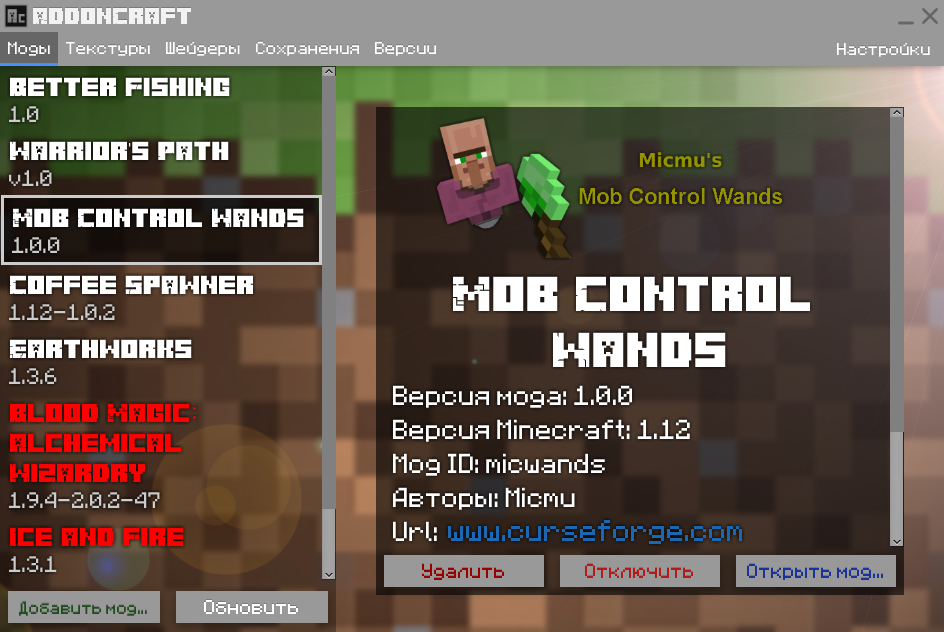

# AddonCraft
#### Программа, позволяющая с комфортом и удобством, работать со всеми возможными дополнениями, которые поддерживаются **Minecraft**!

### Возможности программы:
- **Приятный дизайн** - Стильный и современный дизайн.
- **Многофункциональный интерфейс** - Огромный функционал для работы с дополнениями Minecraft.
- **Все дополнения** - Работать можно абсолютно со всем:
    - **Текстуры**
    - **Моды**
    - **Шейдеры**
    - **Версии Minecraft**
    - **Карты (сохранения)**
- **"Минималистический" размер** - Программа в один файл, а занимает, всего лишь, 14-16 МБ на Вашем жестком диске.
- **Автообновление программы** - Программа, всегда будет предлагать Вам перейти на новую версию, если такова имеется. После чего, автоматически загрузится и установится без Вашего вмешательства.
